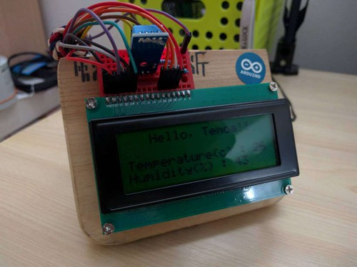

## 基于Arduino 的温湿计
兴趣使然，用手头剩下的东西做了一个温湿计，很粗糙，大家看看就好。

<p>
总体是这样，非常粗狂！主要是因为懒
***
## 配件
* Arduino uno
* DHT11 温湿度传感器
* LCD2004
* 4个1K 电阻
* 杜邦线若干
* 面包版

## 接线
LCD与Arduino uno接线
* RS      ->    digital 12
* Enable  ->    digital 11
* D4      ->    digital 5
* D5      ->    digital 4
* D6      ->    digital 3
* D7      ->    digital 2
* R/W     ->    ground
* VSS     ->    ground
* VCC     ->    5V

VO，本来应该是接一个可调电位器的，可是手头没有。就尝试了一下，使用4个1k 的电阻串联，一头接VO，一头接地可以获得较好的显示效果。

还有，如果你要有背光，就需要接上A 和K 两个管脚，就是第pin 15、pin 16，分别接电源和地。我这里就算了，亮了晚上睡不着。

DHT11和Arduino uno接线
* VCC  -> 3.3V
* DATA -> digital 7
* GND  -> ground

因为用的是模块化的DHT11，所以就3个接口。

## 烧录
代码查看example.ino 文件。使用的是Arduino IDE 1.6.8

## 其他
发现很多童鞋都不知道如何用LCD2004 配合Arduino，教程比较少（可能是我蠢，没找到 - -||| ）。
其实用1.6.8里面的LiquidCrystal 库也是可以的。

连线和上面说的一样。

在代码中，初始化的时候，传入RS、Enable、D4、D5、D6、D7与Arduino连接的相应的管脚
```Arduino
LiquidCrystal lcd(12, 11, 5, 4, 3, 2);
```
在setup()中设置LCD的列数和行数。LCD2004是20列4行
```Arduino
lcd.begin(20, 4);
```
需要打印显示的时候
```Arduino
lcd.setCursor(0, 0); // 设置游标在第1列的第1行,都是从0开始计数
lcd.print("Hello World!");
```
更多的方法可以查看一下这个库，这里只是讲下基本的用法。

## 交流学习
email: temoa_yui@163.com<p>
weibo: [Tem0a_](http://weibo.com/lailaizuiaiyiyi/profile?rightmod=1&wvr=6&mod=personinfo)<p>
